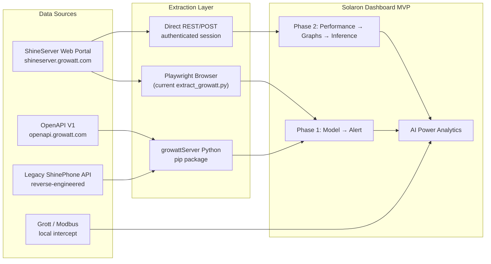
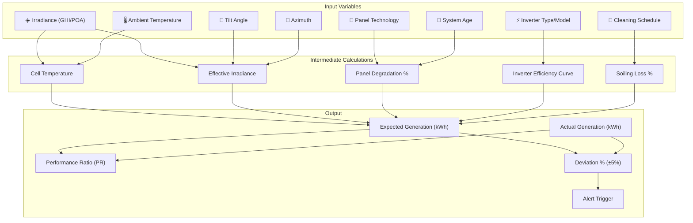

# Growatt ShineServer — Complete Data Sitemap & Extractable Analytics

> Comprehensive map of every extractable data point, analytical surface, and variable from `shineserver.growatt.com`, organized for the **Solaron Dashboard MVP** — power generation modeling, variable impact analysis, and alert-driven plant management.

---

## Architecture Overview



---

## 1. 🏭 Plant-Level Data

### 1.1 Plant List & Metadata
| Field | API Method | Type | Analytics Use |
|---|---|---|---|
| `plantId` | `plant_list()` | String | Primary key for all queries |
| `plantName` | `plant_list()` | String | Display/grouping |
| `plantType` | `plant_list()` | Int | System classification (grid-tie, hybrid, off-grid) |
| `nominal_Power` | `plant_info()` | Float (W) | **Capacity baseline for PR calculation** |
| `capacity_kwp` | Custom/local | Float (kWp) | **Installed capacity — denominator for yield** |
| `latitude` / `longitude` | `plant_info()` | Float | **Tilt optimization (latitude ≈ optimal tilt angle)** |
| `city` / `country` | `plant_info()` | String | Regional performance benchmarking |
| `installDate` | `plant_settings()` | Date | **Degradation curve start point** |
| `timezone` | `plant_info()` | String | Time normalization |
| `panelBrand` / `panelModel` | `plant_settings()` | String | **Panel technology classification** |
| `inverterBrand` / `inverterModel` | `device_list()` | String | **Inverter P/O efficiency comparison** |
| `currency` / `formulaMoney` | `plant_settings()` | Float | Revenue calculation |
| `Co2Reduction` | `plant_info()` | Float | ESG reporting |

### 1.2 Plant Energy Totals
| Field | API Method | Granularity | Analytics Use |
|---|---|---|---|
| `todayEnergy` | `plant_info()` | Daily (kWh) | **Daily generation tracking** |
| `totalEnergy` | `plant_info()` | Lifetime (kWh) | Cumulative performance |
| `monthEnergy` | `plant_detail(type=2)` | Monthly (kWh) | **Monthly trend: low/mid/high classification** |
| `yearEnergy` | `plant_detail(type=2)` | Yearly (kWh) | Annual yield comparison |
| `peakPowerActual` | `plant_info()` | Instant (kW) | Peak capacity utilization |
| `currentPower` / `currentPac` | `plant_info()` | Real-time (W) | Live monitoring |

### 1.3 Plant Charts (Time-Series)
| Endpoint | Parameters | Data Returned | Analytics Use |
|---|---|---|---|
| `PlantDetailAPI.do` | `type=0` (hour) | Hourly power curve for a day | **Intraday generation shape analysis** |
| `PlantDetailAPI.do` | `type=1` (day) | Daily energy for a month | **±5% deviation detection** |
| `PlantDetailAPI.do` | `type=2` (month) | Monthly energy for a year | **Seasonal trend: low/mid/high** |
| `/panel/getPlantDetailChart` | `plantId, date, type` | Chart JSON with axis data | **Graph rendering for inference (Phase 2)** |
| `/panel/getPlantDetailInverterChart` | `plantId, date, type` | Per-inverter power curves | **Inverter P/O comparison** |

---

## 2. ⚡ Inverter-Level Data

### 2.1 Inverter Metadata
| Field | API Method | Type | Analytics Use |
|---|---|---|---|
| `deviceSn` | `device_list()` | String | Unique device identifier |
| `deviceType` | `device_list()` | Int | **Inverter type classification** (1=inverter, 2=storage, etc.) |
| `deviceModel` | `inverter_detail()` | String | **Model-specific efficiency curves** |
| `deviceStatus` | `device_list()` | Int | **Online/Offline status → Alert trigger** |
| `firmwareVersion` | `inverter_detail()` | String | Firmware-based performance differences |
| `lastUpdateTime` | `inverter_detail()` | DateTime | **Staleness detection → communication alert** |

### 2.2 Inverter Real-Time Telemetry
| Field | API Method | Unit | Analytics Use |
|---|---|---|---|
| `ppv` / `ppv1` / `ppv2` | `inverter_detail()` | W | **PV string-level power (MPPT tracking)** |
| `vpv1` / `vpv2` | `inverter_detail()` | V | PV string voltage — shading/fault detection |
| `ipv1` / `ipv2` | `inverter_detail()` | A | PV string current — mismatch detection |
| `pac` / `pac1` / `pac2` / `pac3` | `inverter_detail()` | W | **AC output power per phase** |
| `vac1` / `vac2` / `vac3` | `inverter_detail()` | V | Grid voltage per phase |
| `iac1` / `iac2` / `iac3` | `inverter_detail()` | A | Grid current per phase |
| `fac` | `inverter_detail()` | Hz | Grid frequency |
| `temperature` / `ipmTemperature` | `inverter_detail()` | °C | **Inverter thermal performance** |
| `powerFactor` | `inverter_detail()` | - | Power quality |
| `efficiency` | Calculated | % | **ppv → pac conversion efficiency** |

### 2.3 Inverter Energy Counters
| Field | API Method | Unit | Analytics Use |
|---|---|---|---|
| `eToday` / `e_today` | `inverter_detail()` | kWh | **Daily generation per inverter** |
| `eTotal` / `e_total` | `inverter_detail()` | kWh | Lifetime generation per inverter |
| `eMonth` | `inverter_data()` | kWh | Monthly inverter output |
| `totalHour` | `inverter_detail()` | Hours | **Operating hours → availability calculation** |

### 2.4 Inverter Historical Data
| API Method | Parameters | Data Shape | Analytics Use |
|---|---|---|---|
| `inverter_data(sn, date)` | Serial, Date | 5-min interval power curve | **High-res intraday performance** |
| `inverter_detail_two(sn)` | Serial | Extended metrics snapshot | Additional telemetry fields |
| `device.energy_history()` | start/end date (7-day max) | Time-series energy | **Short-term trend analysis** |

---

## 3. 🔋 Storage / Hybrid (MIX/SPH) Data

### 3.1 Battery Status
| Field | API Method | Unit | Analytics Use |
|---|---|---|---|
| `SOC` | `mix_info()` / `sph.detail()` | % | Battery state of charge |
| `pdisCharge` | `mix_info()` | W | Discharge power |
| `pCharge` | `mix_info()` | W | Charge power |
| `vBat` | `mix_detail()` | V | Battery voltage |
| `batTemperature` | `sph.detail()` | °C | Battery thermal health |
| `dischargePower` / `chargePower` | `tlx_energy_prod_cons()` | kWh | Energy flow direction |

### 3.2 Energy Flow (Hybrid Systems)
| Field | API Method | Unit | Analytics Use |
|---|---|---|---|
| `pToGrid` / `exportToGrid` | `mix_info()` | W / kWh | Grid export power/energy |
| `pFromGrid` / `importFromGrid` | `mix_info()` | W / kWh | Grid import power/energy |
| `pSelf` / `selfConsumption` | `mix_info()` | W / kWh | Self-consumption ratio |
| `loadPower` / `pLocalLoad` | `mix_info()` | W | Total load power |
| `batteryDischargeToday` | `mix_info()` | kWh | Daily battery discharge |
| `batteryChargeToday` | `mix_info()` | kWh | Daily battery charge |

---

## 4. 🌤️ Environmental / Weather Data

### 4.1 From Environmental Sensors (if hardware present)
| Field | Source | Unit | Analytics Use |
|---|---|---|---|
| `irradiance` / `sunlightIntensity` | Environmental monitor API | W/m² | **GHI/POA for PR calculation** |
| `ambientTemp` / `temperature` | Environmental monitor | °C | **Temperature coefficient derating** |
| `moduleTemp` / `panelTemp` | Environmental monitor | °C | **Cell temp → efficiency loss model** |
| `windSpeed` | Environmental monitor | m/s | Cooling effect on panels |
| `windDirection` | Environmental monitor | ° | Convective cooling analysis |
| `humidity` | Environmental monitor | % | Soiling/condensation risk |

### 4.2 External Weather APIs (supplementary)
| Source | Data Point | Analytics Use |
|---|---|---|
| OpenWeatherMap / Visual Crossing | GHI, DHI, DNI | **Expected generation baseline** |
| NASA POWER API | Monthly solar irradiance by lat/lon | **Long-term performance ratio** |
| IMD (India Meteorological Dept) | Regional weather alerts | **Generation dip attribution** |

---

## 5. 📊 Dashboard / Aggregate Analytics

### 5.1 Dashboard Widgets (up to 12 selectable)
| Widget | Data Points | Analytics Use |
|---|---|---|
| Revenue | `formulaMoney × eToday/eTotal` | Financial performance |
| CO₂ Reduction | `Co2Reduction` | ESG metrics |
| Tree Planting Equivalent | Derived from CO₂ | Marketing/reporting |
| Current Power | `currentPower` (W) | Live status |
| Today's Energy | `todayEnergy` (kWh) | Daily KPI |
| Monthly Energy | `monthEnergy` (kWh) | Monthly KPI |
| Total Energy | `totalEnergy` (kWh) | Lifetime KPI |
| Self-Consumption Rate | `selfConsumption / totalGeneration` | Optimization metric |

### 5.2 Plant Overview Aggregate
| Field | API | Analytics Use |
|---|---|---|
| `totalPlants` | `plant_list()` | Portfolio scale |
| `onlinePlants` / `offlinePlants` | `plant_list()` | **Fleet health → alert trigger** |
| `totalCapacity` | Sum of `nominal_Power` | Portfolio capacity |
| `totalEnergyToday` | Sum of `todayEnergy` | Portfolio daily yield |

---

## 6. 🚨 Alerts & Fault Data

### 6.1 Device Alarms
| Field | Source | Analytics Use |
|---|---|---|
| `faultCode` / `warningCode` | `inverter_detail()` | **Fault classification → automated alert** |
| `deviceStatus` values | `device_list()` | 0=offline, 1=online, 2=fault → **Phase 1 alert** |
| `lastUpdateTime` gap | Calculated | **Communication loss detection** |
| Alarm history | Web UI alarm page | Historical fault frequency |

### 6.2 Smart I-V Curve (OSS Platform)
| Data Point | Source | Analytics Use |
|---|---|---|
| String I-V curves | OSS / ShineTools app | **PV module fault diagnosis** |
| Mismatch detection | I-V analysis | String-level performance issues |
| Shading analysis | I-V curve shape | **Localized shading impact** |

---

## 7. 🔧 Configuration & Settings Data

### 7.1 Plant Settings
| Field | API | Analytics Use |
|---|---|---|
| `formulaMoney` | `plant_settings()` | Revenue per kWh |
| `formulaMoneyUnit` | `plant_settings()` | Currency |
| `designCapacity` | `plant_settings()` | Design vs actual capacity |
| `panelNumber` | `plant_settings()` | Module count |
| `panelWatt` | `plant_settings()` | Individual module wattage |
| `tiltAngle` | Custom/local data | **Tilt optimization vs latitude** |
| `azimuth` | Custom/local data | Orientation efficiency |

### 7.2 Inverter Settings (Read)
| Field | API | Analytics Use |
|---|---|---|
| `activePowerRate` | `inverter_params()` | Power curtailment detection |
| `reactivePowerRate` | `inverter_params()` | Reactive power setting |
| `batteryMode` | `sph.detail()` | Load-first / Battery-first / Grid-first |
| `gridVoltageHigh/Low` | `inverter_params()` | Grid protection settings |
| `gridFreqHigh/Low` | `inverter_params()` | Frequency protection settings |

---

## 8. 📈 Derived Analytics Variables (For Your Model)

### 8.1 Power Generation Model Variables



### 8.2 Key Analytical Formulas

| Metric | Formula | Data Sources |
|---|---|---|
| **Performance Ratio (PR)** | `Actual_kWh / (GHI × Capacity_kWp × PR_ref)` | `eToday`, irradiance, `nominal_Power` |
| **Specific Yield** | `eTotal / capacity_kWp` (kWh/kWp) | `eTotal`, `capacity_kwp` |
| **Capacity Utilization** | `peakPower / nominal_Power × 100` | `currentPower`, `nominal_Power` |
| **Tilt Efficiency** | Actual vs optimal tilt (lat ±5°) | `tilt_angle`, `latitude` |
| **Inverter Efficiency** | `pac / ppv × 100` | `pac`, `ppv` from `inverter_detail()` |
| **Availability** | `onlineHours / totalHours × 100` | `deviceStatus` timestamps |
| **Degradation Rate** | Year-over-year specific yield decline | Multi-year `eTotal` data |
| **Generation Classification** | Z-score vs fleet mean → low/mid/high | All plant `eToday` values |

### 8.3 Inverter Difference in P/O (Your Key Factor)

| Comparison Axis | Data Needed | Insight |
|---|---|---|
| **String vs Micro vs Hybrid** | `inverter_type` + `eToday` per plant | Which topology outperforms? |
| **Same model, different plants** | `deviceModel` + `eToday` | Environmental impact isolation |
| **Same plant, different inverters** | Multiple `inverter_detail()` per plant | String-level performance |
| **Efficiency curve** | `ppv` vs `pac` at different irradiance levels | Partial-load efficiency |
| **Temperature derating** | `temperature` vs `pac` regression | Thermal performance hit |

---

## 9. 🗺️ API Access Map

### 9.1 Extraction Methods Comparison

| Method | Auth | Rate Limit | Data Scope | Best For |
|---|---|---|---|---|
| **OpenAPI V1** (`openapi.growatt.com`) | Token | ~1 req/5min | Plant, Device, Energy, Settings | **Production data pipeline** |
| **Legacy ShinePhone** (`growattServer` lib) | User/Pass | Similar | Full legacy surface | Rapid prototyping |
| **Playwright Browser** ([extract_growatt.py](file:///c:/Users/raaji/Downloads/Solaron/Dashboard%20MVP/extract_growatt.py)) | Session cookies | UI-dependent | Everything visible in UI | Initial exploration/debugging |
| **Grott (local)** | None (LAN) | Real-time | Raw inverter telemetry | High-frequency monitoring |

### 9.2 Currently Used in Your Project

Your [extract_growatt.py](file:///c:/Users/raaji/Downloads/Solaron/Dashboard%20MVP/extract_growatt.py) currently uses **Playwright browser automation** to:
1. Log in via session cookies
2. Call internal endpoints: `/index/getPlantListTitle`, `/panel/getPlantList`, `/panel/getPlantData`, etc.
3. Capture network traffic for API discovery
4. Export to CSV/JSON

Your [plants_data.json](file:///c:/Users/raaji/Downloads/Solaron/Dashboard%20MVP/plants_data.json) contains 20 plants across Nagpur, Pune, Mumbai with:
- `capacity_kwp`, `panel_technology` (poly/mono_perc/topcon/hjt), `inverter_type` (string/micro/hybrid), `tilt_angle`, `install_date`, `cleaning_schedule`

---

## 10. 🎯 Mapping to Your Project Phases

### Phase 1: Model → Alert to Customer

| Task | Data Required | Source |
|---|---|---|
| Check if plant is online | `deviceStatus` | `device_list()` |
| Daily generation vs expected | `eToday` vs model prediction | `plant_info()` + weather API |
| ±5% deviation flag | `(actual - expected) / expected` | Calculated |
| Communication loss alert | `lastUpdateTime` gap > threshold | `inverter_detail()` |
| Inverter fault alert | `faultCode ≠ 0` | `inverter_detail()` |
| Low generation classification | Z-score across fleet | All plants `eToday` |

### Phase 2: Performance → Graphs → Inference

| Analysis | Graph Type | Data |
|---|---|---|
| Daily generation trend | Line chart | `PlantDetailAPI.do` type=1 |
| Inverter comparison | Multi-line overlay | Per-inverter `inverter_data()` |
| Tilt angle efficiency | Scatter plot | `tilt_angle` vs specific yield |
| Panel tech comparison | Box plot by tech | `panel_technology` vs `eToday/capacity_kwp` |
| Inverter type P/O | Bar chart | `inverter_type` vs avg efficiency |
| Seasonal patterns | Heatmap | Monthly energy × year |
| Temperature derating | Regression plot | `temperature` vs `pac/ppv` |
| Soiling impact | Before/after cleaning | `eToday` around cleaning dates |

### Current Tools Benchmark

| Tool | What It Does | Gap for Solaron |
|---|---|---|
| **Smart Helio** | Soiling loss estimation | Doesn't cover inverter P/O analysis |
| **AI Power Analytics** | ML-based forecasting | Generic, not plant-specific alerting |
| **PV-Syst** | Design simulation reports | No real-time monitoring integration |

---

## 11. 📋 Complete Data Field Inventory

> [!TIP]
> This is the exhaustive list of every field extractable from the Growatt ecosystem. Fields marked with ⭐ are critical for your power generation model.

### Plant Fields (47 fields)
```
plantId, plantName, plantType, nominal_Power ⭐, latitude ⭐, longitude ⭐,
city, country, timezone, installDate ⭐, createDate,
todayEnergy ⭐, totalEnergy ⭐, monthEnergy ⭐, yearEnergy,
currentPower ⭐, peakPowerActual, Co2Reduction, treePlanting,
formulaMoney, formulaMoneyUnit, currency,
panelBrand, panelModel, panelWatt ⭐, panelNumber ⭐,
inverterBrand, inverterModel,
designCapacity, gridConnectedDate,
plantStatus ⭐, onlineDevices, offlineDevices ⭐,
totalDevices, dataLoggerSn,
plantImg, mapLat, mapLng,
eToday_money, eTotal_money,
selfConsumptionRate, exportRate,
batterySOC, gridPower, loadPower,
weatherTemp, weatherCondition, weatherCity
```

### Inverter Fields (62 fields)
```
deviceSn, deviceType ⭐, deviceModel ⭐, deviceStatus ⭐,
lastUpdateTime ⭐, firmwareVersion,
ppv ⭐, ppv1 ⭐, ppv2, ppv3, ppv4,
vpv1 ⭐, vpv2, vpv3, vpv4,
ipv1 ⭐, ipv2, ipv3, ipv4,
pac ⭐, pac1, pac2, pac3,
vac1 ⭐, vac2, vac3,
iac1 ⭐, iac2, iac3,
fac ⭐, frequency,
temperature ⭐, ipmTemperature,
eToday ⭐, eTotal ⭐, eMonth, eYear,
totalHour ⭐, operatingHours,
powerFactor, efficiency ⭐,
faultCode ⭐, warningCode ⭐, errorMessage,
activePowerRate, reactivePowerRate,
dcBusVoltage, pBusVoltage, nBusVoltage,
insulationResistance, countryCode,
gridVoltageHigh, gridVoltageLow,
gridFreqHigh, gridFreqLow,
startVoltage, ratedPower ⭐,
maxOutputPower, inputMode,
communicationStatus, dataLogSn
```

### Storage/Battery Fields (28 fields)
```
SOC ⭐, vBat, iBat,
pCharge, pdisCharge,
batTemperature ⭐,
dischargePowerToday, chargePowerToday,
dischargePowerTotal, chargePowerTotal,
batteryType, batteryCapacity ⭐,
pToGrid, pFromGrid,
exportToGridToday, importFromGridToday,
exportToGridTotal, importFromGridTotal,
selfConsumption, selfConsumptionRate,
loadPower, pLocalLoad,
batteryMode, batteryVoltage,
batteryCurrent, batterySOH,
chargeCycles, batteryFaultCode
```

### Environmental Fields (12 fields)
```
irradiance ⭐, sunlightIntensity,
ambientTemp ⭐, moduleTemp ⭐,
windSpeed, windDirection,
humidity, rainfall,
barometricPressure,
uvIndex,
soilTemperature, soilMoisture
```

---

> [!IMPORTANT]
> **Total Extractable Data Points: ~149 unique fields** across plant, inverter, storage, and environmental domains. Your existing [plants_data.json](file:///c:/Users/raaji/Downloads/Solaron/Dashboard%20MVP/plants_data.json) captures only **7 of these** (capacity, panel_tech, inverter_type, tilt_angle, install_date, city, cleaning_schedule). There's a massive data surface still untapped.
