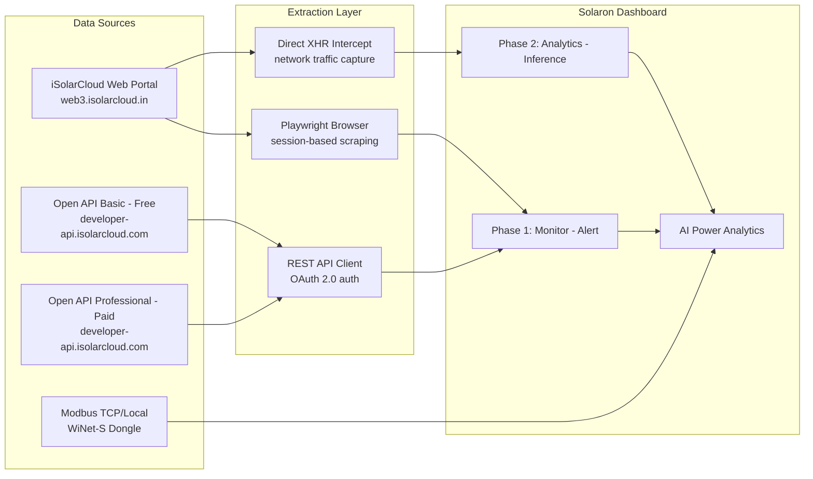
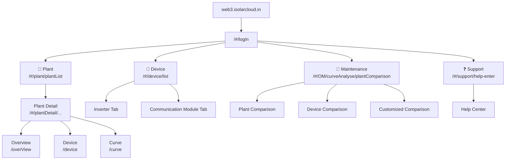

# Sungrow iSolarCloud (IN) — Complete Data Sitemap & Extractable Analytics

> Comprehensive map of every extractable data point from `web3.isolarcloud.in`, organized by **free (web portal login)** vs **paid (Open API)** access for the **Solaron Dashboard** — covering plant monitoring, power generation analytics, and alert-driven management.

---

## Architecture Overview



---

## Web Portal Navigation Structure



---

## Access Tiers Summary

| Tier | Cost | Auth Method | Rate Limit | Best For |
|---|---|---|---|---|
| **Web Portal (Login)** | Free | Email + Password | UI-bound | Manual monitoring, visual dashboards |
| **Web Portal (Visitor)** | Free | Guest login | UI-bound (demo data) | Exploring portal features |
| **Open API — Basic** | Free | OAuth 2.0 (App Key + Secret) | ~5 min polling | Personal/small-scale automation, Home Assistant |
| **Open API — Professional** | Paid (quote-based) | OAuth 2.0 (App Key + Secret) | Higher limits | Commercial EMS, VPP, MQTT live data, grid control |
| **Modbus TCP (Local)** | Free (hardware) | LAN access | Real-time | High-frequency local monitoring |

---

## 1. Plant List (FREE — Web Portal)

**Route**: `/#/plant/plantList`

### 1.1 Header Stats Bar
| Data Point | Value Example | Extractable | Analytics Use |
|---|---|---|---|
| Total Installed Capacity (kWp) | 143.00 kWp | Via UI scrape | **Capacity baseline for PR** |
| Daily Generation (kWh) | 141.10 kWh | Via UI scrape | **Daily generation tracking** |
| Total Active Power (kW) | 61.80 kW | Via UI scrape | Live fleet power |
| Total Cumulative Generation | 1.05 GWh | Via UI scrape | Lifetime performance |
| Total Fault Plants | 0 | Via UI scrape | **Alert trigger** |

### 1.2 Search & Filter Controls
| Control | Type | Purpose |
|---|---|---|
| Plant Type dropdown | Filter | Filter by plant type (C&I PV, Residential, etc.) |
| Plant name or device S/N | Search | Free-text search |
| Filter button | Advanced filter | Additional filter criteria |

### 1.3 Plant Status Tabs
| Tab | Count (Demo) | Extractable | Analytics Use |
|---|---|---|---|
| All | 1 | Yes | Portfolio scale |
| Following | 1 | Yes | Watchlist |
| Normal | 1 | Yes | **Fleet health baseline** |
| Abnormal | 0 | Yes | **Immediate alert trigger** |
| Offline | 0 | Yes | **Communication loss alert** |
| Commissioning unfinished | 0 | Yes | Deployment tracking |

### 1.4 Plant List Table Columns
| Column | Type | Extractable | Analytics Use |
|---|---|---|---|
| Plant name | String | Yes | Display/grouping |
| Status | Normal/Abnormal/Offline | Yes | **Status-based alerting** |
| Plant type | String (C&I PV, etc.) | Yes | Plant classification |
| Installed power (kWp) | Float | Yes | Capacity reference |
| Real-time power (kW) | Float | Yes | **Live monitoring** |
| Yield (kWh) | Float | Yes | **Daily KPI per plant** |
| Action (Favorite ⭐) | Toggle | Yes | Watchlist management |

> [!TIP]
> **Optional columns** button allows adding/removing columns. **List/Grid view toggle** switches between table and card layouts.

---

## 2. Plant Detail (FREE — Web Portal)

**Route**: `/#/plantDetail/overView?{encoded_params}`

### 2.1 Overview Sub-Tab

#### Energy Flow Diagram
| Data Point | Granularity | Extractable | Analytics Use |
|---|---|---|---|
| Plant Status | Real-time | Yes | Status monitoring |
| Weather Temperature (°C) | Real-time | Yes | **Weather correlation** |
| Real-time Power (kW) | Real-time | Yes | **Live output monitoring** |
| Installed Power (kWp) | Static | Yes | **Capacity baseline** |
| PV → Load → Grid flow animation | Real-time | Yes | Energy flow visualization |

#### Energy Analysis Section
| Data Point | Granularity | Extractable | Analytics Use |
|---|---|---|---|
| Energy Analysis (kWh) | Day/Week/Month/Year/Lifetime/Custom | Yes | **Primary generation KPI** |
| Production (kWh) | Day/Week/Month/Year/Lifetime/Custom | Yes | **Production tracking** |
| Net Revenue | Day/Week/Month/Year/Lifetime/Custom | Yes | Financial KPI |

#### Power Curve Chart
| Data | Granularity | Extractable | Analytics Use |
|---|---|---|---|
| PV Power (W) vs Time | 5-min intervals (intraday) | Yes | **Intraday generation shape** |
| Date selector | Day-by-day navigation | Yes | Historical comparison |
| Chart export/download button | On-demand | Yes | Data extraction |

#### Emission Reduction Cards
| Metric | Value Example | Extractable | Analytics Use |
|---|---|---|---|
| CO₂ Reduction (t) | 891.11 | Yes | ESG reporting |
| Standard Coal Saved (t) | 361.09 | Yes | Environmental impact |
| Equivalent Trees Planted | 48,655 | Yes | Marketing metric |

### 2.2 Device Sub-Tab

**Route**: `/#/plantDetail/device?{encoded_params}`

#### Device Filters
| Control | Type | Purpose |
|---|---|---|
| Device type | Dropdown | Filter by Inverter / Communication module |
| Device status | Dropdown | Filter by Normal / Abnormal / Offline |
| Device name/Device S/N | Search | Free-text search |
| List/Grid view toggle | Toggle | Switch between table and card layouts |

#### Inverter Cards (Grid View)
| Field | Type | Extractable | Analytics Use |
|---|---|---|---|
| Device Name | String | Yes | Identification |
| Status (Normal/Abnormal) | Badge | Yes | **Device health** |
| Inverter S/N | String | Yes | **Primary key** |
| Daily Generation (kWh) | Float | Yes | **Daily per-inverter yield** |
| Total Active Power (kW) | Float | Yes | **Live output monitoring** |
| Associated Devices/N | String | Yes | Device topology |

#### Communication Module Cards (Grid View)
| Field | Type | Extractable | Analytics Use |
|---|---|---|---|
| Module Name | String (e.g., WiFi V31_001_247) | Yes | Identification |
| Status (Normal/Abnormal) | Badge | Yes | **Communication health** |
| Communication Module S/N | String | Yes | Primary key |
| Operating Status | Int | Yes | Status code |
| WLAN Signal Strength | String / -- | Yes | **Connectivity quality** |

### 2.3 Curve Sub-Tab

**Route**: `/#/plantDetail/curve?{encoded_params}`

| Feature | Detail | Extractable | Analytics Use |
|---|---|---|---|
| Device Selector | Dropdown (select inverter) | Yes | Per-device analysis |
| Time Range Tabs | Day / Week / Month / Year / Custom | Yes | Flexible analysis |
| Date Navigator | Forward/back arrows + date display | Yes | Historical browsing |
| Interval Selector | 15 min (configurable) | Yes | Resolution control |
| Filter button | Parameter filter | Yes | Multi-variable selection |
| Power (kW) Chart | Time-series with area fill | Yes | **High-res intraday performance** |
| Fullscreen toggle | Expand chart | N/A | UX feature |
| Refresh button | Manual refresh | N/A | UX feature |

---

## 3. Device Management (FREE — Web Portal)

**Route**: `/#/device/list`

### 3.1 Inverter Tab

#### Filters
| Control | Type | Purpose |
|---|---|---|
| All plants | Dropdown | Filter by plant |
| Device name/Device S/N | Search | Free-text search |
| Device model | Dropdown | Filter by model (SG33CX, SG110CX, etc.) |
| List/Grid view toggle | Toggle | Display format |

#### Inverter Table Columns
| Column | Type | Extractable | Analytics Use |
|---|---|---|---|
| Device name | String | Yes | Identification |
| Device model | String | Yes | **Model-specific comparison** |
| Device S/N | String (masked in demo) | Yes | **Primary key for queries** |
| Device status | Normal/Abnormal/Offline | Yes | **Device health alerting** |
| Daily generation (kWh) | Float | Yes | **Daily per-inverter yield** |
| Total active power (kW) | Float | Yes | **Live output monitoring** |
| Action | View details | Yes | Navigate to device detail |

### 3.2 Communication Module Tab

#### Communication Module Table Columns
| Column | Type | Extractable | Analytics Use |
|---|---|---|---|
| Module name | String (e.g., WiFi V31_001_247) | Yes | Identification |
| Module model | String | Yes | Model classification |
| Module S/N | String | Yes | Primary key |
| Module status | Normal/Abnormal/Offline | Yes | **Communication loss alert** |
| Operating status | Int | Yes | Status code |
| WLAN signal strength | String / -- | Yes | **Connectivity quality** |
| Action | View details | Yes | Navigate to module detail |

---

## 4. Maintenance — Curve Analysis (FREE — Web Portal)

**Route**: `/#/OM/curveAnalyse/plantComparison`

> [!NOTE]
> The Maintenance section on the `.in` portal is focused on **Curve Analysis** (comparison tools). It does NOT include separate Alarms, Fault management, or Work Order pages — those are accessed through plant-level alerts and device status indicators.

### 4.1 Plant Comparison Tab

**Route**: `/#/OM/curveAnalyse/plantComparison`

| Feature | Detail | Extractable | Analytics Use |
|---|---|---|---|
| Select Plant | Dropdown (plant name or device S/N) | Yes | Plant selection |
| Select Measuring Point | Dropdown | Yes | Metric selection |
| Time Range Tabs | Day / Week / Month / Year / Custom | Yes | Flexible analysis |
| Interval Selector | 15 min (configurable) | Yes | Resolution control |
| Refresh Interval | Checkbox + configurable (default 5 min) | Yes | Auto-refresh |
| Template Library | Save/load comparison templates | Yes | Reusable presets |
| Clear | Reset comparison | N/A | UX feature |

### 4.2 Device Comparison Tab

**Route**: `/#/OM/curveAnalyse/deviceComparison`

| Feature | Detail | Extractable | Analytics Use |
|---|---|---|---|
| Asset Tree | Plant → Grid connection point → Unit → Inverter → Communication module | Yes | **Device hierarchy traversal** |
| Select Measuring Point | Dropdown | Yes | Metric selection |
| Time Range & Interval | Same as Plant Comparison | Yes | Flexible analysis |

### 4.3 Customized Comparison Tab

**Route**: `/#/OM/curveAnalyse/customizedComparison`

| Feature | Detail | Extractable | Analytics Use |
|---|---|---|---|
| Custom parameter selection | Multi-device, multi-metric overlay | Yes | **Cross-device correlation** |
| Asset Tree | Full plant hierarchy | Yes | Device selection |
| Flexible time ranges | Day / Week / Month / Year / Custom | Yes | Historical analysis |

---

## 5. Support & Help Center (FREE — Web Portal)

**Route**: `/#/support/help-enter`

### 5.1 Quick Access Tools
| Tool | Purpose |
|---|---|
| New User Registration | Account creation guide |
| Change Password | Password reset flow |
| User Manual | Full platform documentation |

### 5.2 FAQ Categories
| Category | Example Topics |
|---|---|
| **Account Related** | Obtain account, forgot login, change login, account deletion |
| **Plant Related** | Create plant, share plant, delete plant, modify organization |
| **Inverter Related** | View inverter, grid overvoltage, grid undervoltage, grid overfrequency |
| **Communication Module Related** | Eye indicator status, WLAN configuration, E-Net indicator, WiNet LED status |
| **Other Issues** | View user manual, email delivery issues |

---

## 6. Open API — Basic Tier (FREE after registration)

> **Portal**: [developer-api.isolarcloud.com](https://developer-api.isolarcloud.com)
> **Auth**: OAuth 2.0 (App Key + App Secret + RSA Key)
> **Approval**: Requires Sungrow review (~2-5 business days)

### 6.1 Available Endpoints (Basic Tier)
| Endpoint Category | Data | Polling Rate | Analytics Use |
|---|---|---|---|
| **Plant List** | All plants under account | ~5 min | Portfolio enumeration |
| **Plant Detail** | Generation stats, status, metadata | ~5 min | **Plant KPIs** |
| **Device List** | All devices per plant | ~5 min | Device inventory |
| **Device Detail** | Real-time telemetry per device | ~5 min | **Device monitoring** |
| **Historical Data** | Energy yield over time | ~5 min | Trend analysis |
| **System Status** | Online/offline, fault status | ~5 min | **Alert automation** |

### 6.2 Key Data Points (Basic Tier)
| Field | Type | Unit | Analytics Use |
|---|---|---|---|
| `total_power` | Float | kW | Real-time total power |
| `day_energy` | Float | kWh | **Daily generation** |
| `month_energy` | Float | kWh | Monthly generation |
| `year_energy` | Float | kWh | Yearly generation |
| `total_energy` | Float | kWh | Lifetime generation |
| `device_status` | Int | - | **Online/Offline/Fault** |
| `grid_import_energy` | Float | kWh | Grid consumption |
| `grid_export_energy` | Float | kWh | Grid feed-in |
| `battery_soc` | Float | % | Battery state (if storage) |

---

## 7. Open API — Professional Tier (PAID)

> **Pricing**: Quote-based from Sungrow (contact service@sungrow-emea.com)
> **Target**: Commercial EMS, Virtual Power Plant (VPP), advanced integrations

### 7.1 Additional Endpoints (Professional Only)
| Feature | Description | Use Case |
|---|---|---|
| **MQTT Live Data Stream** | Real-time push notifications | VPP / high-frequency monitoring |
| **Grid Control Endpoints** | Remote active/reactive power control | Grid compliance / curtailment |
| **Battery Management** | Charge/discharge scheduling | Energy arbitrage |
| **Plant Configuration** | Create/edit plant attributes via API | Fleet management automation |
| **Higher Rate Limits** | Increased API call quotas | Large-scale deployments |
| **Advanced Measuring Points** | Extended telemetry enumeration | Deep analytics |
| **Multi-Dimensional Monitoring** | Cross-device, cross-plant queries | Enterprise dashboards |

### 7.2 What You CANNOT Get Without Professional Tier
| Feature | Basic | Professional |
|---|---|---|
| Real-time MQTT push | No | Yes |
| Grid/device remote control | No | Yes |
| Battery scheduling commands | No | Yes |
| Plant creation/edit via API | No | Yes |
| High call volume (>1000/day) | No | Yes |
| Dedicated technical support | No | Yes |

---

## 8. Extraction Methods Comparison

| Method | Cost | Auth | Data Scope | Automation | Best For |
|---|---|---|---|---|---|
| **Web Portal (Manual)** | Free | Email/Pass | Full UI data | Manual only | Initial exploration |
| **Playwright Scraping** | Free | Session cookies | Full UI + XHR data | Automatable | **Current best option** |
| **XHR Intercept** | Free | Captured tokens | Raw API responses | Automatable | API endpoint discovery |
| **Open API Basic** | Free | OAuth 2.0 | Standard monitoring | Fully automated | **Production pipeline** |
| **Open API Professional** | Paid | OAuth 2.0 | Full platform access | Fully automated | Enterprise/commercial |
| **Modbus TCP (Local)** | Free | LAN | Raw inverter data | Real-time | On-site high-frequency |

---

## 9. Derived Analytics Variables

### 9.1 Key Formulas
| Metric | Formula | iSolarCloud Source |
|---|---|---|
| **Inverter Efficiency** | `Pac / Ppv * 100` | Device detail page |
| **Specific Yield** | `eToday / capacity_kWp` (kWh/kWp) | Plant detail + metadata |
| **Capacity Utilization** | `currentPower / installedPower * 100` | Plant list header |
| **Fleet Deviation** | `(plant_yield - fleet_avg) / fleet_avg * 100` | All plants eToday |
| **Availability** | `online_hours / total_hours * 100` | Device status timestamps |
| **Performance Ratio** | `actual_kWh / (GHI * kWp * PR_ref)` | Yield + external weather |

---

## 10. Complete Data Field Inventory

> [!TIP]
> Fields marked with * are critical for Solaron power generation analytics. Fields marked with [PAID] require paid API access.

### Portal-Extractable Fields (FREE — ~55 fields)
```
plantName, plantStatus*, plantType, installedCapacity_kWp*, location,
currentPower_kW*, yieldToday_kWh*, cumulativeGeneration_GWh*,
totalFaultPlants*, weatherTemp_C,

energyAnalysis_kWh*, production_kWh*, netRevenue,
CO2Reduction_t, standardCoalSaved_t, equivalentTrees,
pvPowerCurve_W* (5-min intervals),

deviceName, deviceModel*, deviceSN*, deviceType*,
deviceStatus* (Normal/Abnormal/Offline),
dailyGeneration_kWh*, totalActivePower_kW*,
associatedDevicesN,

commModuleName, commModuleSN, commModuleStatus*,
operatingStatus, wlanSignalStrength,

curvePower_kW* (15-min intervals),
plantComparison_data, deviceComparison_data,
customComparison_data
```

### API-Only Fields (BASIC Tier — FREE — ~20 additional fields)
```
grid_import_energy, grid_export_energy,
battery_soc, battery_power,
selfConsumptionRate, selfConsumptionEnergy,
plantId (numeric key), timezone,
deviceFirmwareVersion, ratedPower,
historicalData_timeseries*
```

### API-Only Fields (PROFESSIONAL Tier — PAID — ~30 additional fields)
```
mqtt_realtime_stream [PAID], activePowerControl [PAID],
reactivePowerControl [PAID], batteryChargeSchedule [PAID],
batteryDischargeSchedule [PAID], plantCreateEdit [PAID],
advancedMeasuringPoints [PAID], gridVoltageHighLow [PAID],
gridFreqHighLow [PAID], insulationResistance [PAID],
dcBusVoltage [PAID], startVoltage [PAID]
```

---

## 11. Key Differences: `.in` Portal vs `.com.hk` Portal

| Feature | `.com.hk` (Old) | `.in` (Current) |
|---|---|---|
| **Domain** | `web3.isolarcloud.com.hk` | `web3.isolarcloud.in` |
| **Navigation** | 7+ sidebar items | 4 sidebar items (Plant, Device, Maintenance, Support) |
| **Plant List Stats** | Power, Yield Today/Month/Total, Revenue, Faults/Alarms | Installed Capacity, Daily Gen, Active Power, Cumulative Gen, Faults |
| **Plant Status Tabs** | All, Following, Normal, Abnormal | All, Following, Normal, Abnormal, Offline, **Commissioning unfinished** |
| **Plant Detail Sub-Tabs** | Overview, Device, Curve, Map, Information | Overview, Device, Curve (no Map or Information) |
| **Plant Overview** | Power curve + generation history + metadata | Energy flow + energy analysis + power curve + emission reduction |
| **Reports Section** | Dedicated reports page with Excel export | **Not available as standalone page** |
| **Alarms/Faults Section** | Dedicated fault management page | **Integrated into device status indicators** |
| **Maintenance Section** | Not documented | **Curve Analysis** with Plant/Device/Customized comparison |
| **Support Section** | Not documented | **Help Center** with Quick Access + FAQs |
| **Revenue Metrics** | Revenue Today/Month/Total (INR) | Net Revenue (per time range) |
| **Environmental Metrics** | CO₂ Reduction, Equivalent Trees | CO₂ Reduction, **Standard Coal Saved**, Equivalent Trees |

---

## 12. Recommended Extraction Strategy for Solaron

### Immediate (FREE — No API needed)
| Action | Tool | Data |
|---|---|---|
| Scrape plant list for fleet overview | Playwright automation | All plants status, power, daily generation |
| Scrape plant detail overview | Playwright automation | Energy analysis, production, power curves |
| Scrape device tab for device inventory | Playwright automation | Per-inverter daily generation + active power |
| Use Maintenance → Curve Analysis for comparison data | Playwright automation | Multi-plant and multi-device curve overlays |
| Monitor device status for fault detection | Playwright + status checks | Normal/Abnormal/Offline status per device |

### Short-term (FREE — API Basic registration)
| Action | Tool | Data |
|---|---|---|
| Register on developer portal | Manual (one-time) | App Key, App Secret, RSA Key |
| Build REST client with OAuth 2.0 | Python script | Automated data pipeline |
| Poll every 5 minutes | Cron job / scheduler | Plant + device telemetry |

### Long-term (PAID — if scale demands)
| Action | Tool | Data |
|---|---|---|
| MQTT live stream | Professional API | Real-time sub-5min data |
| Remote grid control | Professional API | Active/reactive power |
| Battery scheduling | Professional API | Charge/discharge optimization |

---

> [!IMPORTANT]
> **The `.in` portal has a simpler navigation** than the `.hk` version — 4 main sections (Plant, Device, Maintenance, Support) vs the old 7+. Key differences: **no standalone Reports or Alarms pages** (reports may require API access; fault management is through device status indicators). The **Maintenance section** provides powerful Curve Analysis comparison tools (plant vs plant, device vs device, customized). For Excel exports, investigate XHR intercept during curve/chart interactions — the chart download buttons may provide exportable data.
