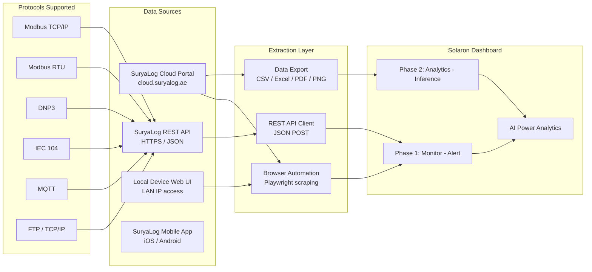
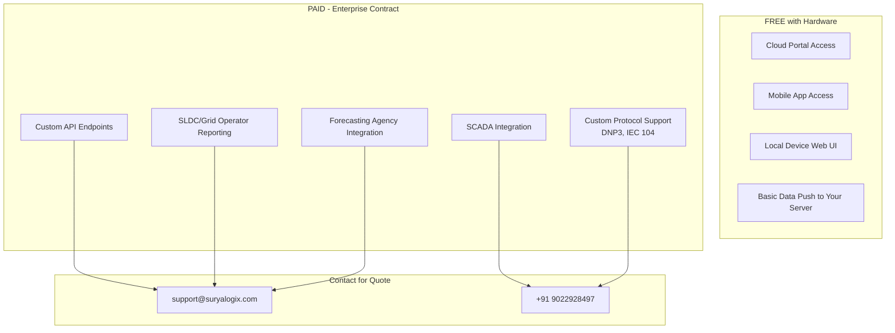

# SuryaLog Cloud — Complete Data Sitemap & Extractable Analytics

> Comprehensive map of every extractable data point from `cloud.suryalog.ae`, organized by **free (web portal login)** vs **paid (API/integration)** access for the **Solaron Dashboard** — covering solar plant monitoring, performance analytics, and alert-driven management.

---

## Architecture Overview



---

## Access Tiers Summary

| Tier | Cost | Auth Method | Data Scope | Best For |
|---|---|---|---|---|
| **Cloud Portal (Login)** | Included with hardware | Username + Password | Full monitoring, reports, exports | Daily monitoring, Excel/CSV/PDF exports |
| **REST API (Push)** | Bundled with service contract | Configured during commissioning | Device-to-server JSON data push | Third-party portal integration |
| **Enterprise API** | Custom quote from Suryalogix | Project-specific | Full telemetry, SCADA, grid compliance | SLDC reporting, forecasting agencies |
| **Local Device UI** | Free (LAN) | IP-based access | Raw device data | Offline/backup monitoring |

> [!NOTE]
> SuryaLog's model is **hardware-bundled** — the cloud portal and basic API come included with their monitoring hardware purchase (units range from INR 55,000-70,000+). There is no separate SaaS subscription for the web portal. Advanced API integrations are negotiated as part of project contracts.

---

## 1. Main Dashboard (FREE — Web Portal Login)

### 1.1 Portfolio Overview
| Data Point | Type | Extractable | Analytics Use |
|---|---|---|---|
| Total Plants/Sites | Count | Yes | Portfolio scale |
| Plant Status Summary | Normal/Fault/Offline | Yes | **Fleet health overview** |
| Total Generation Today | kWh | Yes | **Daily fleet KPI** |
| Total Installed Capacity | kWp/MW | Yes | Capacity reference |
| Live Power Output | kW | Yes | Real-time monitoring |
| Performance Ratio (PR) | % | Yes | **System efficiency KPI** |
| CO2 Savings | Tonnes | Yes | ESG reporting |

### 1.2 Dashboard Views
| View Type | Description | Extractable | Analytics Use |
|---|---|---|---|
| **Graphical View** | Charts and trend graphs | Yes (screenshots/data) | Visual analysis |
| **Tabular View** | Raw data tables | Yes (direct scrape) | Data extraction |
| **Block Diagram View** | System topology diagram | Yes (visual) | Configuration overview |
| **Single Line Diagram (SLD)** | Electrical schematic | Yes (visual) | Engineering reference |

---

## 2. Plant Monitoring (FREE — Web Portal)

### 2.1 Generation Data
| Field | Unit | Granularity | Extractable | Analytics Use |
|---|---|---|---|---|
| Live Energy Output | kW | Real-time | Yes | **Instantaneous monitoring** |
| Daily Generation | kWh | Per day | Yes | **Daily KPI tracking** |
| Monthly Generation | kWh | Per month | Yes | **Monthly trend analysis** |
| Yearly Generation | kWh | Per year | Yes | Annual performance |
| Cumulative Generation | MWh | Lifetime | Yes | Lifetime performance |
| Generation vs Consumption | kWh | Comparative | Yes | Self-consumption analysis |

### 2.2 Performance Metrics
| Metric | Unit | Extractable | Analytics Use |
|---|---|---|---|
| Performance Ratio (PR) | % | Yes | **System efficiency** |
| Specific Yield | kWh/kWp | Yes | **Normalized output** |
| Plant Load Factor (PLF) | % | Yes | Capacity utilization |
| CO2 Savings | kg/tonnes | Yes | ESG reporting |
| Equivalent Hours (ESH) | hours | Yes | Sunshine equivalent |

### 2.3 Electrical Parameters
| Parameter | Unit | Extractable | Analytics Use |
|---|---|---|---|
| AC Power (Total) | kW | Yes | **Output monitoring** |
| AC Voltage (per phase) | V | Yes | Grid quality |
| AC Current (per phase) | A | Yes | Load analysis |
| Power Factor (PF) | - | Yes | Power quality |
| Frequency | Hz | Yes | Grid stability |
| Reactive Power | kVAR | Yes | Grid compliance |
| Apparent Power | kVA | Yes | Transformer loading |

---

## 3. Inverter Monitoring (FREE — Web Portal)

### 3.1 Inverter Status and Telemetry
| Field | Unit | Extractable | Analytics Use |
|---|---|---|---|
| Inverter Status | Online/Offline/Fault | Yes | **Fault detection** |
| AC Output Power | kW | Yes | **Per-inverter output** |
| DC Input Power per MPPT | kW | Yes | **String-level monitoring** |
| DC Voltage per MPPT | V | Yes | Shading/mismatch detection |
| DC Current per MPPT | A | Yes | String current analysis |
| Inverter Temperature | C | Yes | **Thermal derating** |
| Daily Generation (per inverter) | kWh | Yes | **Inverter P/O comparison** |
| Total Generation (per inverter) | kWh | Yes | Lifetime per-inverter yield |
| Efficiency | % | Yes | **DC-to-AC conversion** |

### 3.2 Multi-Inverter Comparison
| Feature | Extractable | Analytics Use |
|---|---|---|
| Side-by-side inverter performance | Yes | **Identify underperformers** |
| Combined vs individual power curves | Yes | Fleet optimization |
| Inverter-level fault history | Yes | Reliability tracking |

---

## 4. String/SMB Monitoring (FREE — Web Portal)

### 4.1 String Monitoring Box (SMB) Data
| Parameter | Unit | Range | Extractable | Analytics Use |
|---|---|---|---|---|
| Individual String Currents (up to 14) | A | 0-30A | Yes | **String-level fault detection** |
| Input Voltage | V | 200-1500 VDC | Yes | Voltage monitoring |
| Total Input Current | A | Aggregate | Yes | Total DC current |
| Total Input Power | kW | Aggregate | Yes | Total DC power |
| Internal Temperature | C | - | Yes | Equipment health |
| External Temperature | C | - | Yes | Ambient conditions |
| String Current Mismatch | % | Calculated | Yes | **Shading/soiling detection** |

> [!TIP]
> **String-level monitoring is a major differentiator** — SuryaLog provides granular per-string current data (up to 14 strings per SMB) which is critical for detecting partial shading, soiling, and module-level faults. This data is freely available through the portal.

---

## 5. Weather Station Data (FREE — if sensors installed)

### 5.1 Environmental Parameters
| Parameter | Unit | Extractable | Analytics Use |
|---|---|---|---|
| Solar Irradiance (GHI/DNI) | W/m2 | Yes | **PR calculation baseline** |
| Ambient Temperature | C | Yes | **Temperature coefficient derating** |
| Module Temperature | C | Yes | **Cell temp efficiency model** |
| Wind Speed | m/s | Yes | Panel cooling effect |
| Wind Direction | degrees | Yes | Convective analysis |
| Humidity | % | Yes | Soiling/condensation risk |
| Rainfall | mm | Yes | Cleaning effect tracking |
| Soiling Level | % | Yes | **Soiling loss estimation** |

> [!IMPORTANT]
> Weather data availability depends on whether a SuryaLog weather station is installed at the plant site. If present, this is extremely valuable free data for PR calculations and generation modeling.

---

## 6. Energy Meter Data (FREE — Web Portal)

### 6.1 Meter Parameters
| Parameter | Unit | Extractable | Analytics Use |
|---|---|---|---|
| Total Active Power (W) | kW | Yes | **Net power flow** |
| Total Apparent Power (VA) | kVA | Yes | Transformer loading |
| Total Reactive Power (VAR) | kVAR | Yes | Grid compliance |
| Average Power Factor (PF) | - | Yes | Power quality |
| Frequency | Hz | Yes | Grid stability |
| Line Voltages (VLL) | V | Yes | Voltage monitoring |
| Phase Voltages (VLN) | V | Yes | Phase balance |
| Total Energy | kWh | Yes | **Cumulative metering** |
| Import/Export Energy | kWh | Yes | **Net metering analysis** |

---

## 7. Reports and Data Export (FREE — Web Portal)

### 7.1 Report Types
| Report Type | Content | Timeframe | Analytics Use |
|---|---|---|---|
| **Daily Generation Report** | Per-plant daily energy production | Day | **Daily KPI tracking** |
| **Monthly Performance Report** | Aggregated monthly performance with PR | Month | **Monthly trend** |
| **Yearly Summary Report** | Annual generation and financial summary | Year | Annual review |
| **Inverter Performance Report** | Per-inverter daily/monthly data | Day/Month | **Inverter comparison** |
| **Alarm/Event Report** | Historical alarms with timestamps | Selectable | **Downtime analysis** |
| **Custom Parameter Report** | User-selected parameters and dates | Custom | **Ad-hoc analysis** |

### 7.2 Export Formats
| Format | Available | Best For |
|---|---|---|
| **Excel (.xlsx)** | Yes | Data analysis, pivot tables |
| **CSV** | Yes | **Automated data pipeline** |
| **PDF** | Yes | Client reports, documentation |
| **PNG (Charts)** | Yes | Presentations, dashboards |

### 7.3 Export Workflow
| Step | Detail |
|---|---|
| Navigate to Reports | Select report type from menu |
| Select Parameters | Choose plant, devices, date range |
| Generate Report | View on-screen preview |
| Download | Click export in desired format (Excel/CSV/PDF/PNG) |

---

## 8. Alarms and Event Management (FREE — Web Portal)

### 8.1 Alarm Data
| Data Point | Type | Extractable | Analytics Use |
|---|---|---|---|
| Alarm Type | Fault/Warning/Info | Yes | **Severity classification** |
| Alarm Description | String | Yes | Root cause identification |
| Alarm Timestamp | DateTime | Yes | **Downtime tracking** |
| Affected Device | Inverter/Meter/SMB | Yes | Device-level history |
| Alarm Status | Active/Acknowledged/Resolved | Yes | Resolution tracking |
| Duration | Minutes/Hours | Yes | **MTTR calculation** |

### 8.2 Alert Features
| Feature | Available | Detail |
|---|---|---|
| Real-time Alarm Dashboard | Yes | Live fault monitoring |
| Email Notifications | Yes | Configurable recipients |
| SMS Alerts | Yes (if configured) | Critical fault alerts |
| App Push Notifications | Yes | Via SuryaLog mobile app |
| Alarm History Export | Yes | CSV/Excel download |
| Root Cause Analysis Tools | Yes | AI-assisted diagnostics |

---

## 9. Control Features (FREE — Portal, hardware-dependent)

### 9.1 Remote Control Capabilities
| Feature | Available | Detail |
|---|---|---|
| Active Power Control | Yes (with PPC) | Remote power curtailment |
| Reactive Power Control | Yes (with PPC) | VAR management |
| Zero Export Control | Yes | Prevent grid feed-in |
| Firmware Update | Yes | Remote device updates |
| Configuration Changes | Yes | Parameter adjustments |
| Breaker Status (ACB/MCCB/VCB) | Yes | **Protection monitoring** |

---

## 10. SuryaLog REST API (BUNDLED with hardware/contract)

### 10.1 API Architecture
| Aspect | Detail |
|---|---|
| Protocol | HTTPS |
| Data Format | JSON |
| Request Method | POST (device pushes data to server) |
| Authentication | Configured during commissioning |
| Push Interval | Configurable (typically 1-15 min) |
| Direction | **Device → Server (push model)** |

### 10.2 API Data Parameters — Meter (`_mtr_` prefix)
| Parameter | Key | Unit | Analytics Use |
|---|---|---|---|
| Total Active Power | `_mtr_w` | kW | **Net power** |
| Total Apparent Power | `_mtr_va` | kVA | Transformer load |
| Total Reactive Power | `_mtr_var` | kVAR | Grid compliance |
| Average Power Factor | `_mtr_pf` | - | Power quality |
| Frequency | `_mtr_freq` | Hz | Grid stability |
| Line Voltages | `_mtr_vll` | V | Voltage monitoring |
| Phase Voltages | `_mtr_vln` | V | Phase balance |
| Total Energy | `_mtr_whtot` | kWh | **Cumulative energy** |

### 10.3 API Data Parameters — String Combiner Box (`_scb_` prefix)
| Parameter | Key | Unit | Analytics Use |
|---|---|---|---|
| Input Voltage | `_scb_v` | V | DC voltage |
| Total Input Current | `_scb_itot` | A | Total DC current |
| Total Input Power | `_scb_ptot` | kW | Total DC power |
| Internal Temperature | `_scb_inttemp` | C | Equipment health |
| External Temperature | `_scb_exttemp1` | C | Ambient temp |
| String Current 1-14 | `_scb_i1` to `_scb_i14` | A | **Per-string monitoring** |

### 10.4 API Data Parameters — Inverter
| Parameter | Key | Unit | Analytics Use |
|---|---|---|---|
| AC Power Output | Inverter-specific | kW | **Generation monitoring** |
| DC Input per MPPT | Inverter-specific | kW | String performance |
| Status | Inverter-specific | Code | Fault detection |
| Daily Energy | Inverter-specific | kWh | **Daily yield** |
| Temperature | Inverter-specific | C | Thermal monitoring |

### 10.5 API Access Model



---

## 11. Third-Party Integration (PAID — Custom Contract)

### 11.1 Enterprise Features (quote-based)
| Feature | Protocol | Use Case | Pricing |
|---|---|---|---|
| SLDC Reporting | FTP / REST | Government grid compliance | Project contract |
| Forecasting Agency Feed | REST / MQTT | Generation forecasting | Project contract |
| SCADA Integration | Modbus / DNP3 / IEC 104 | Industrial control systems | Project contract |
| Custom Dashboard Feed | REST API | White-label portals | Project contract |
| Multi-site Aggregation | REST API | Portfolio management | Project contract |

### 11.2 What Requires Paid Enterprise Access
| Feature | Free Portal | Enterprise |
|---|---|---|
| Cloud portal monitoring | Yes | Yes |
| Mobile app | Yes | Yes |
| Report exports (Excel/CSV/PDF) | Yes | Yes |
| Basic data push API | Yes (with hardware) | Yes |
| Custom API endpoints | No | Yes |
| SLDC/regulatory reporting | No | Yes |
| SCADA/DNP3/IEC104 integration | No | Yes |
| Multi-protocol support | No | Yes |
| Dedicated support SLA | No | Yes |

---

## 12. Complete Data Field Inventory

> [!TIP]
> Fields marked with * are critical for Solaron analytics. Fields marked with [ENTERPRISE] require a paid enterprise contract.

### Portal-Extractable Fields (FREE — ~90 fields)
```
Plant Level:
  plantName, plantStatus*, installedCapacity*, location,
  currentPower_kW*, generationToday_kWh*, generationMonth_kWh*,
  generationYear_kWh, totalGeneration_MWh,
  performanceRatio_pct*, specificYield*, PLF*,
  CO2Savings, revenueToday, revenueMonth, revenueTotal

Inverter Level:
  inverterName, inverterStatus*, inverterModel*,
  acPower_kW*, dcPower_kW*, dcVoltage_V, dcCurrent_A,
  acVoltage_V, acCurrent_A, frequency_Hz,
  inverterTemp_C*, eToday_kWh*, eTotal_kWh*,
  efficiency_pct*

String/SMB Level:
  stringCurrent_1 through stringCurrent_14*,
  inputVoltage_V, totalCurrent_A, totalPower_kW,
  internalTemp_C, externalTemp_C

Meter Level:
  activePower_kW*, apparentPower_kVA, reactivePower_kVAR,
  powerFactor*, frequency_Hz,
  lineVoltage_V, phaseVoltage_V,
  totalEnergy_kWh*, importEnergy_kWh, exportEnergy_kWh

Weather Station (if installed):
  irradiance_Wm2*, ambientTemp_C*, moduleTemp_C*,
  windSpeed_ms, windDirection_deg,
  humidity_pct, rainfall_mm, soilingLevel_pct*

Alarms:
  alarmType*, alarmDescription, alarmTimestamp*,
  affectedDevice*, alarmStatus*, alarmDuration*

Control:
  activePowerSetpoint, reactivePowerSetpoint,
  zeroExportStatus, breakerStatus*
```

### API Push Fields (INCLUDED with hardware — ~45 fields)
```
_mtr_w*, _mtr_va, _mtr_var, _mtr_pf*, _mtr_freq,
_mtr_vll, _mtr_vln, _mtr_whtot*,
_scb_v, _scb_itot, _scb_ptot,
_scb_inttemp, _scb_exttemp1,
_scb_i1* through _scb_i14*,
inverter_ac_power*, inverter_dc_power*,
inverter_status*, inverter_temp*,
inverter_daily_energy*, inverter_total_energy*
```

### Enterprise API Fields (PAID — ~20 additional fields) [ENTERPRISE]
```
scada_control_commands [ENTERPRISE],
sldc_reporting_feed [ENTERPRISE],
forecasting_api_feed [ENTERPRISE],
dnp3_protocol_data [ENTERPRISE],
iec104_protocol_data [ENTERPRISE],
custom_aggregation_queries [ENTERPRISE],
multi_site_portfolio_api [ENTERPRISE],
dedicated_webhook_endpoints [ENTERPRISE]
```

---

## 13. Recommended Extraction Strategy for Solaron

### Immediate (FREE — Already available with login)
| Action | Tool | Data |
|---|---|---|
| Daily CSV/Excel export of generation data | Playwright automation / manual | Per-plant daily generation |
| Download inverter performance reports | Playwright automation / manual | Per-inverter metrics |
| Scrape dashboard for real-time KPIs | Playwright + data scraping | Power, PR, yield |
| Export alarm history | Manual CSV download | Fault codes, timestamps |
| Extract weather data (if sensors present) | Playwright + data scraping | Irradiance, temp, wind |
| String current monitoring | Playwright + data scraping | Per-string I values |

### Short-term (FREE — API data push configuration)
| Action | Tool | Data |
|---|---|---|
| Request API push to your server | Contact support@suryalogix.com | Configure data push endpoint |
| Build JSON receiver endpoint | Python Flask/FastAPI | Automated data ingestion |
| Store incoming data in database | PostgreSQL / SQLite | Historical time-series |

### Long-term (PAID — if enterprise features needed)
| Action | Tool | Data |
|---|---|---|
| SCADA integration | DNP3/IEC 104 | Industrial control |
| SLDC compliance reporting | FTP/REST | Government reporting |
| Custom portfolio API | REST | Multi-site aggregation |

---

## 14. SuryaLog vs iSolarCloud Comparison

| Feature | SuryaLog | iSolarCloud |
|---|---|---|
| **Portal Access** | Free with hardware | Free with Sungrow inverters |
| **String-Level Monitoring** | Yes (up to 14 strings) | Limited (MPPT level) |
| **Weather Station Data** | Yes (if hardware present) | Limited (basic weather) |
| **Export Formats** | CSV, Excel, PDF, PNG | Excel only |
| **API Model** | Push (device to server) | Pull (client polls server) |
| **API Cost** | Included with hardware | Free Basic / Paid Professional |
| **SCADA Support** | Yes (DNP3, IEC 104) | No (cloud only) |
| **Breaker Monitoring** | Yes (ACB, MCCB, VCB) | No |
| **Zero Export Control** | Yes | Limited |
| **Developer Portal** | No (contact-based) | Yes (developer-api.isolarcloud.com) |
| **Plants in Account** | Check portal | 28 plants |

---

> [!IMPORTANT]
> **SuryaLog's value proposition is different from iSolarCloud** — it's a hardware+software bundle where the cloud portal and basic API come included with the monitoring device purchase. The portal provides richer plant-level data (string monitoring, weather, breaker status) than most cloud-only platforms. For Solaron, the key advantage is the **granular string-level data and integrated weather station data** which are both free to extract. Enterprise API features (SCADA, SLDC reporting) are only needed for utility-scale compliance.
